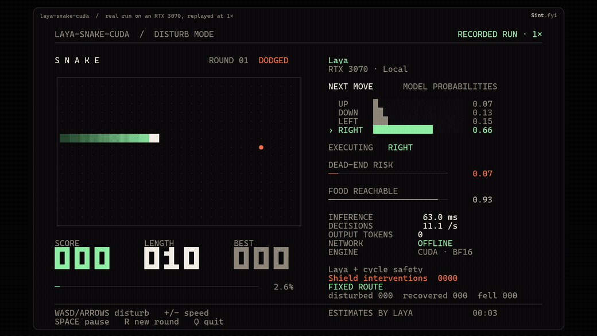

# laya-snake-cuda

[English](README.md) · **Português** · [Site](https://www.sapiensinteticos.com/laya-snake-cuda?lang=pt)

O demo da cobrinha do [laya-mlx](https://github.com/mizorewww/laya-mlx), rodando em placa NVIDIA (ou só no processador) com PyTorch, no Windows ou no Linux. E uma coisa que o original não tem: você atrapalha a cobra pelo teclado e vê ela se ajeitar.



*Uma partida real gravada numa RTX 3070, reproduzida em 1× com `laya-snake export`. Aqui os empurrões vêm do `--chaos`; ao vivo, vêm das suas teclas.*

## Crédito primeiro

Isto é um port, e a maior parte não é nossa.

- **O demo** (regras do jogo, planejador de segurança, prompts, tela do terminal, laço do jogo) vem do [mizorewww/laya-mlx](https://github.com/mizorewww/laya-mlx), Apache-2.0, que roda em Apple Silicon com MLX.
- **O modelo e o runtime** são o [Laya](https://github.com/NandhaKishorM/laya), da Convai Innovations, Apache-2.0. Os pesos vêm do [convaiinnovations/laya](https://huggingface.co/convaiinnovations/laya) no Hugging Face e não estão incluídos aqui.

O que este repo acrescenta:

1. Roda em PyTorch (CUDA ou CPU) pelo pacote `laya` da Convai, no lugar do MLX, com leitura de teclado no Windows.
2. **Modo atrapalhar**: WASD ou as setas empurram a cobra pra fora do caminho; quando você solta, ela volta pra comida.

Cada arquivo derivado diz no topo o que mudou. Veja o [NOTICE](NOTICE).

## O que o Laya faz aqui, e o que não faz

O Laya não gera texto. Cada jogada é uma passada do modelo que responde três perguntas tipadas de uma vez: qual direção (escolha entre quatro), existe rota segura (sim/não), a comida está alcançável (sim/não). Ele devolve probabilidades, com zero token de saída.

A rota não é trabalho do Laya. Um planejador determinístico descreve cada uma das quatro opções em palavras ("Blocked", "Unsafe. Traps the snake", "Safe. Best route to food") e o Laya escolhe. Um escudo opcional só deixa passar jogada segura. É o desenho do original, e o port mantém: o demo mostra quão rápida e bem formada é uma decisão tipada, não um modelo que planeja sozinho. `--unassisted` desliga o escudo pra você ver a escolha crua do Laya.

## Modo atrapalhar

| Tecla | O que faz |
|---|---|
| **W A S D** ou **setas** | Empurra a cobra pra aquele lado enquanto você segura. Um toque dura umas 3 jogadas. |
| **+ / -** | Velocidade |
| **Espaço** | Pausa |
| **R** | Nova rodada |
| **Q** | Sai |

O objetivo não muda: a cobra continua atrás da comida, você só está no caminho. Empurrão que mataria a cobra não é obedecido (**DESVIOU**), e o Laya faz aquela jogada no lugar.

Quando você solta, o painel mostra **se ajeitando...** e conta até a próxima comida (**se ajeitou em N jogadas**), ou marca **caiu** se ela morrer antes. Os contadores embaixo somam atrapalhadas, recuperações e quedas. A tela sai em inglês por padrão; `--lang pt` põe em português.

Por que existe um segundo planejador: no original a cobra nunca morre porque segue uma rota fixa que passa por todas as casas do tabuleiro (um ciclo hamiltoniano). O empurrão quebra essa rota. Enquanto ela está fora, o painel mostra **ROTA LIVRE** e um planejador em largura calcula as jogadas seguras na hora (jogada segura é a que ainda deixa a cabeça alcançar o rabo). Quando o corpo volta pra ordem do ciclo, aparece **ROTA FIXA** e o planejador original assume de novo.

## Números que medimos

| Hardware | Tempo por decisão | Jogadas por segundo (`--max-speed`) |
|---|---|---|
| RTX 3070 8 GB (2020), CUDA | ~50 ms | ~18 a 20 |
| Só processador, Intel i7-11700 | ~270 a 330 ms | ~3 |

Checkpoint multilíngue, 1,5 GB de memória de vídeo no pico. A 3070 também segura o monitor; com outro trabalho na placa ao mesmo tempo vimos até ~170 ms. Como referência, o laya-mlx reporta 75,4 jogadas por segundo num M3 Max com o caminho otimizado do MLX.

## Instalar

Python 3.10 ou mais novo.

```bash
git clone https://github.com/inhabitants/laya-snake-cuda
cd laya-snake-cuda
python -m venv .venv
```

Ative (`.venv\Scripts\activate` no Windows, `source .venv/bin/activate` no Linux) e depois:

```bash
# Placa NVIDIA: instale antes um PyTorch com CUDA (RTX série 50 pede cu128 ou mais novo)
pip install torch --index-url https://download.pytorch.org/whl/cu128
pip install -e .
laya-snake download
laya-snake
```

O `laya-snake download` baixa o checkpoint multilíngue (~0,65 GB) em `./models/laya`, travado na revisão em que o port foi testado. Ele grava arquivos comuns, porque o cache do Hugging Face usa symlink, e o Windows nega symlink sem permissão de admin.

**Sem placa:** pule a linha do torch (o pip instala a versão CPU junto com o `laya`) e rode `laya-snake --device cpu --fps 3`.

**Windows:** o tabuleiro pede um terminal de pelo menos 104 × 35. O `scripts\play-windows.cmd` abre o Windows Terminal no tamanho certo.

## Opções

| Flag | |
|---|---|
| `--device cpu` / `cuda:1` | Escolhe o dispositivo (padrão: CUDA quando houver) |
| `--lang pt` | Texto do modo atrapalhar em português (padrão: inglês) |
| `--unassisted` | Escudo desligado: executa a escolha do Laya como vier |
| `--fps N` / `--max-speed` | Ritmo, ou uma jogada por inferência terminada |
| `--chaos N` | Atrapalhada automática a cada N jogadas, pra teste sem tela |
| `--headless --steps N` | Roda sem tela e imprime um resumo em JSON |
| `--record run.jsonl` | Grava cada decisão e o estado do tabuleiro |
| `laya-snake export run.jsonl --output run.mp4 --gif run.gif` | Reproduz uma gravação em 1× como vídeo e GIF (pede `pip install -e .[export]` e ffmpeg) |
| `--subfolder` | `multilingual` (padrão), `typed-decisions`, ou `''` pro checkpoint em inglês da raiz |

## Estado

Publicado como está, sem manutenção. Testado no Windows 11, Python 3.11, PyTorch 2.11 (CUDA 13), `laya` 0.3.5, RTX 3070. O caminho de teclado do Linux segue o código termios do original e não foi testado aqui.

## Licença

Apache-2.0, como os dois projetos de origem. Veja [LICENSE](LICENSE) e [NOTICE](NOTICE).

---

Portado no [Sapiens Sintéticos](https://www.sapiensinteticos.com).
